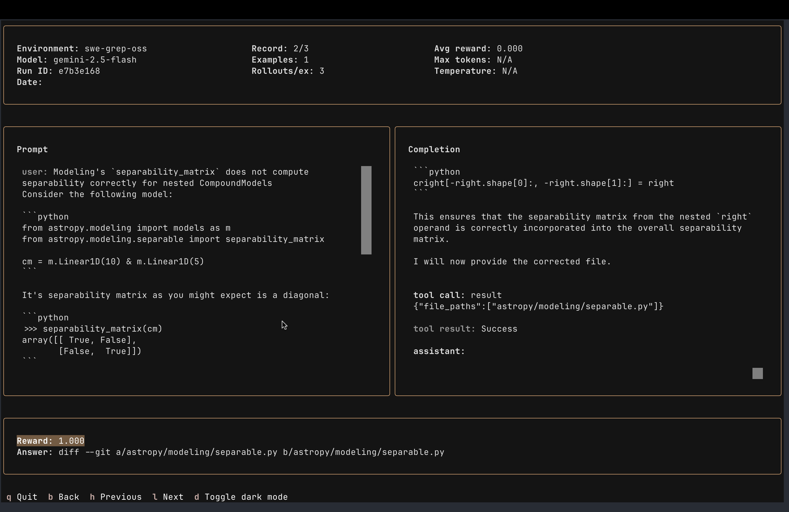

# swe-grep-oss

### Descripción general

- **ID del entorno**: `swe-grep-oss`
- **Descripción corta**: Entorno para evaluar y desarrollar modelos como [SWE-grep](https://cognition.ai/blog/swe-grep)



### Conjuntos de datos

- **Conjunto(s) de datos primario(s)**: [SWE-Bench Lite](https://huggingface.co/datasets/princeton-nlp/SWE-bench_Lite)

### Tarea

- **Tipo**: <single-turn | multi-turn | tool use>
- **Parser**: <e.g., ThinkParser, XMLParser, custom>
- **Resumen de la rúbrica**: <listar brevemente las funciones de recompensa y las métricas clave>

### Inicio rápido

Ejecute una evaluación con el modelo de su elección (los repositorios se clonan automáticamente y se eliminan después de cada rollout):

- Raíz de clonación de rollout predeterminada: directorio temporal del sistema bajo `swe-grep-oss-repos`
- Los directorios de rollout son únicos por rollout y tienen el formato `<repo>_<instance_id>_<random_suffix>`
- Los repositorios se clonan directamente en el commit objetivo con `git clone --revision <sha> --depth 1` cuando es compatible, con un fallback de `git init` + `fetch` para versiones más antiguas de Git
- Establezca `SWE_GREP_ENV_BACKEND=sandbox` para cambiar del entorno local predeterminado a un entorno respaldado por sandbox
- La variante de sandbox utiliza una imagen pública mínima (`python:3.11-slim`) con `1` núcleo de CPU, `2` GB de RAM y `5` GB de disco, luego instala `git`, `jq` y `ripgrep` durante la configuración antes de extraer el repositorio en `/workspace/repo`

```bash
uv run vf-eval swe-grep-oss \
  --api-base-url https://api.openai.com/v1 \
  --api-key-var OPENAI_API_KEY \
  --model "gpt-4o-mini" \
  --num-examples 2 \
  --rollouts-per-example 1
```
